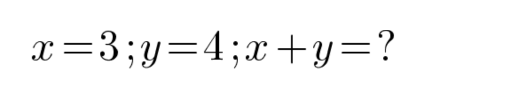
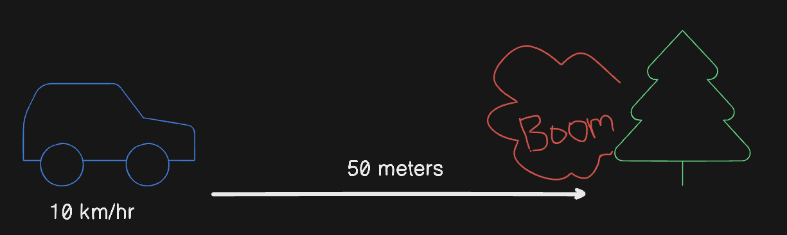

# Canvas Calculator AI

<p align=center>
  
  
  
  
  
</p>

Parse and Analyse image containing mathematical expression or problem (it can be in a drawing format) using AI to give a
structured response by leveraging Langchain framework. Also created API out of it using FastAPI which has containerized
with Docker.

## Prompt Examples

### Example 1



```json
{
  "expression": "x=3;y=4;x+y=?",
  "result": "7",
  "explanation": "The sum of x and y is 7"
}
```

### Example 2



```json
{
  "expression": "10 km/hr * (50 meters / 1000 meters/km) * (3600 seconds / 1 hour)",
  "result": "18 seconds",
  "explanation": "The car is travelling at 10 km/hr and it has to cover 50 meters, so we can calculate the time it takes to cover the distance."
}
```

[**See more examples on my website!**](https://arv-anshul.github.io/project/canvas-ai)

### Features

- [x] :framed_picture: Analyse one image at a time and return a structured response.
- [x] :boom: Create API out of it using FastAPI.
- [x] :whale: Containerize FastAPI app using Docker.
- [ ] Create frontend using Streamlit or else.
- [ ] Add more prompts to process images in different endpoint.
